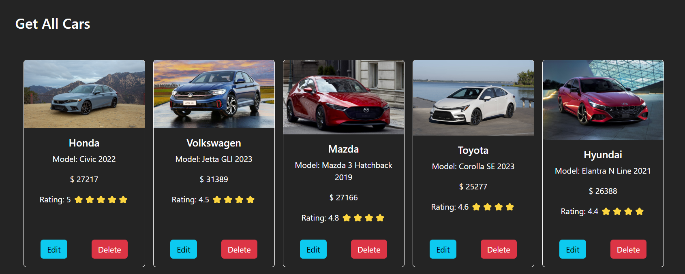

# CRUD API REST CARS

## Http Methods
- GET
- POST
- PUT
- PATCH
- DELETE

### Links

- Guide APi: [api](https://github.com/Diego2Drm/multi-step-form)
- Live Site URL: [crud-api-rest-cars](https://crud-api-rest-cars-diego2d.netlify.app/)


### Screenshot



## My process

### Built with

- Semantic HTML5 markup
- Flexbox
- Mobile-first workflow
- [React](https://reactjs.org/) - JS library
- [Bootstrap 5](https://getbootstrap.com/) - For styles

 ### What I learned

-I learned how to make a crud with the http methods

Commands used
```bash
pnpm create vite
pnpm add bootstrap
pnpm add zod
pnpm add sweetalert2
```

### Continued development
- Express js.
- forms.

## Author

- Website - [Diego Ramírez](https://diego2drm.github.io/Portafolio/)
- Frontend Mentor - [@Diego2Drm](https://www.frontendmentor.io/profile/Diego2Drm)
- Gmail - [diego.ramirez2d03@gmail.com]
